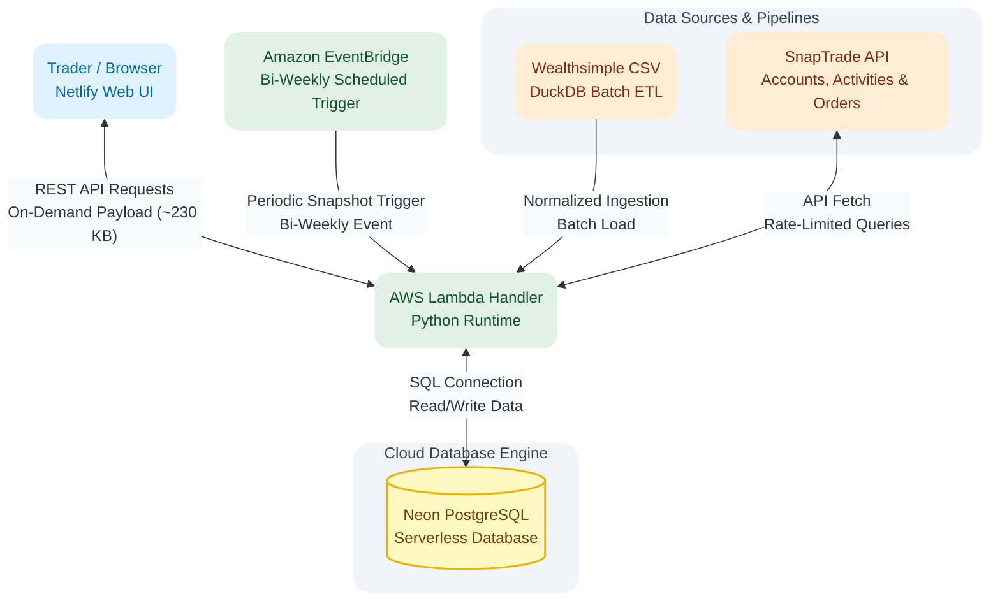

# Multi-Account Portfolio Analytics Engine

A tailored stock analytics tool built to replace complex spreadsheets by syncing multi-account broker feeds into a custom database for real-time cost tracking and trade simulations.

---

## Technical Stack

* **Runtime and Compute:** Python 3.13, AWS Lambda, AWS SAM, Amazon EventBridge (Bi-Weekly Automated Triggers)
* **Database and Data Pipeline:** Neon (Serverless PostgreSQL), Local PostgreSQL, DuckDB (Batch Data Ingestion, Cleaning, and Normalization)
* **Frontend:** Netlify (Web Interface)
* **APIs and Integrations:** SnapTrade API (Accounts, Activities, and Recent Orders endpoints), Wealthsimple CSV Ingestion
* **Development Environment:** Linux / WSL (Ubuntu), PostgreSQL CLI (`psql`)

---

## Project Context and Problem

I built this application for an active private trader managing multiple accounts on Wealthsimple. Since 2019, she tracked all transaction records manually using Excel. Her workflow required a separate Excel workbook for each trading account, with 15 to 30 stock-specific tabs per workbook, plus a master summary tab for analytical tracking. Managing four or five accounts meant constantly updating and switching between separate files and over 80 individual worksheet tabs.

This setup created two main operational challenges:

1. **Dual-Purpose Data Overhead:** The workbooks were forced to function as both a bookkeeping log for individual transactions and an analytical database (OLAP view) for tracking long-term stock performance. Every trade required manual updates across both the specific stock tab and the account summary tab.
2. **Reconciliation and Speed Limitations:** Manually re-entering trade data during active trading hours was slow and required constant comparison against Wealthsimple account balances to catch entry errors. Additionally, she needed to see her updated average purchase price immediately after every buy to make fast trading decisions.

*A Excel workbook example*

---

## Solution and Core Features

I built a serverless web application that eliminates manual spreadsheet entry by processing historical Wealthsimple CSV exports through DuckDB and fetching live trade data from the SnapTrade API into a Neon PostgreSQL database. The application presents all accounts on a single Netlify web interface backed by an AWS Lambda API.

Each trading account dashboard is divided into two primary sub-views: an **Analysis** tab and a **Transaction History** tab.

*Finished application*

### Key Capabilities

* **Automated Dual-Mode API Fetch:** Features two retrieval modes through SnapTrade: a 24-hour daily background sync for account activities, and a real-time (minute-by-minute) fetch for recent orders. Executing a trade in Wealthsimple and refreshing the web app immediately pulls the new transaction.
* **Dual-Mode Portfolio Snapshots (Table & Charts):** Generates point-in-time valuation snapshots using two display modes:
  * **Table View:** Displays current market value, up-to-date average purchase price, overall growth, net revenue, and account weight percentage per stock, with multi-column sorting.
  * **Chart View:** Renders bar and line charts to visualize asset allocation, growth trajectories, and cost-versus-market-price comparisons across stocks within an account over selected timeframes (e.g., 2 weeks or 1 month).
* **Wealthsimple-Aligned Rolling Aggregation Engine:** Uses a specialized database view (`transactions`) with complex SQL window functions to compute custom average purchase prices. The engine recalculates cost basis with every new buy and adjusts totals during sales without altering holding units, matching Wealthsimple's internal calculation logic.
* **DuckDB Ingestion and Normalization Pipeline:** Uses DuckDB to parse, clean, and normalize legacy Wealthsimple CSV exports before loading them into PostgreSQL, standardizing timezones, stock symbols, and unit definitions.
* **Hypothetical Trade Calculator:** Includes a virtual testing tool where the trader can simulate buys or sells at specific market prices. The calculator generates a temporary row on screen to display expected gains, losses, and cost basis changes without committing data to the database.
* **Optimized On-Demand Data Loading:** Loads data on a per-account and per-stock basis upon request, drastically reducing response payloads while staying strictly within free-tier resource limits.

---

## System Architecture

---

## Key Architectural Decisions

### Database Evolution: From Turso to SQLite/EFS to Neon PostgreSQL
The database architecture went through three iterations during development:
1. **Turso (LibSQL):** Evaluated initially, but Turso calculates billing based on total row reads. Because the `transactions` view executes complex window functions across large trade histories, queries rapidly exceeded Turso's read tier limits.
2. **SQLite3 on AWS EFS:** Rebuilt and fully completed the application using SQLite3 with AWS EFS mounting. While functional, testing revealed operational limitations and performance constraints with EFS filesystem mounts during serverless Lambda execution.
3. **Local PostgreSQL to Neon:** Developed and validated the PostgreSQL schema on a local server before migrating to Neon. Neon provides serverless PostgreSQL hosting with cloud persistence, standard SQL window functions, and reliable query execution without filesystem mounts.

### On-Demand Payload Optimization
To avoid hitting payload limits and ensure the app remains fast and lightweight, initial full-database loads were replaced with targeted query fetching. 

Instead of loading the entire multi-year transaction history up front (~4.5 MB payload), the backend loads data on demand per account and per stock. The default view fetches only active stock positions modified within the last 90 days, cutting the initial response payload down to ~230 KB. Older historical records or inactive stock details are loaded only when explicitly requested by the user.

---

## Technical Challenges and Solutions

### 1. Matching Wealthsimple Calculation Logic via Complex SQL Views
* **Context:** Standard portfolio formulas modify holding units or average costs in ways that diverged from Wealthsimple's calculations. The trader required a calculation method that recalculates average buy prices on new purchases, holds cost basis steady during sales, incorporates dividends, and resets all position metrics when a share count hits zero.
* **Solution:** Built a dedicated database view (`transactions`) using SQL window functions partitioned by account, symbol, and trade cycle (`PARTITION BY account_id, symbol, cycle_id`). When a sale reduces a position's share count to zero, an automated trigger increments the `cycle_id` counter for that stock. Subsequent buys use the new `cycle_id`, isolating the new position from historical trade calculations while matching Wealthsimple's underlying math.

### 2. Reconciling Historical Baseline Gaps Between CSV and API Feeds
* **Context:** The trader's history begins in 2019, but SnapTrade API data cutoffs vary randomly by account (some APIs only provide history back to 2022, 2023, or 2025). Furthermore, account opening dates returned by the API are unreliable.
* **Solution:** Established a hybrid ingestion model. Historical trade data from 2019 onward is initialized using Wealthsimple CSV exports processed through a DuckDB pipeline, while ongoing daily activity and real-time order updates are layered on top via the SnapTrade API.

### 3. Normalizing CSV Data Discrepancies via DuckDB
* **Context:** Wealthsimple CSV exports contained several data inconsistencies: timestamps were formatted in local Pacific Time (Vancouver), stock ticker symbols included custom exchange extensions or legacy renamed tickers, and the `units` column was overloaded to represent both transaction quantities and portfolio holdings.
* **Solution:** Built a DuckDB ETL processing script to clean raw CSV records before database insertion. DuckDB converted Pacific timestamps into UTC ISO 8601 strings, mapped renamed tickers to standard symbols, and cleaned the `units` field to distinguish transaction quantities from total holdings.

### 4. Aligning Sign Conventions Across Feeds and Orders API
* **Context:** Wealthsimple CSVs and the SnapTrade Activities API follow cash-flow accounting signs (buys show negative cash amounts and positive units; sells show positive cash amounts and negative units). However, the SnapTrade Orders API (used for real-time 24-hour buy/sell updates) returns all numeric values as positive numbers without directional signs.
* **Solution:** Programmed a sign normalization module in Python for incoming Orders API payloads. The script evaluates the order action (Buy vs. Sell) and dynamically applies appropriate positive or negative signs to units and amounts before writing to the `activities` table. This aligns real-time order data with historical activity feeds, ensuring rolling position calculations in the database remain accurate.

### 5. Preventing API Rate-Limit Overshoot via `last_fetch` Tracking
* **Context:** SnapTrade enforces strict per-minute and per-account rate limits on personal API developer keys. Frequent button clicks or rapid page refreshes risked triggering API rate-limit errors.
* **Solution:** Created a `last_fetch` table that logs timestamps for every API call by account and endpoint type. Before initiating a request to SnapTrade, a backend timer evaluates the elapsed time against required cooldown intervals, preventing duplicate or excessive API requests even under manual user triggers.

---

## Database Schema Architecture

The application database consists of four persistent tables and two analytical views:

1. **`accounts` Table:** Stores trading account metadata fetched from the SnapTrade API.
2. **`activities` Table:** Unified table storing normalized trade records from Wealthsimple CSV exports, SnapTrade daily activities, and real-time SnapTrade orders.
3. **`positions` Table:** Records point-in-time valuation snapshots, asset allocation percentages, and market values per stock and account.
4. **`last_fetch` Table:** Logs API sync timestamps per endpoint and account to enforce rate limits and cooldown intervals.
5. **`transactions` View:** Analytical view that executes window functions (`PARTITION BY account_id, symbol, cycle_id`) across `activities` to compute rolling buy averages, current position holdings, and reset cycles dynamically.
6. **`analysis` View:** Analytical view calculating per-stock performance and valuation metrics by account at a specific point in time upon request (triggered manually or via EventBridge).

